# 🛫 AirConnect

    

`AirConnect`는 **대학생들이 학과, 프로필, 관심 정보를 기반으로 친구찾기와 그룹매칭을 탐색하고, 매칭 이후 실시간 채팅으로 자연스럽게 연결되는 캠퍼스 매칭 서비스**입니다.

단순 매칭 요청에 그치지 않고 **추천 노출, 티켓 차감, 요청/수락/거절, 임시 팀방, 매칭 큐, 최종 채팅방, 알림, 결제/광고 리워드, 운영 관리**까지 하나의 서비스 흐름으로 설계했습니다.

 

# 📗 프로젝트 아키텍처

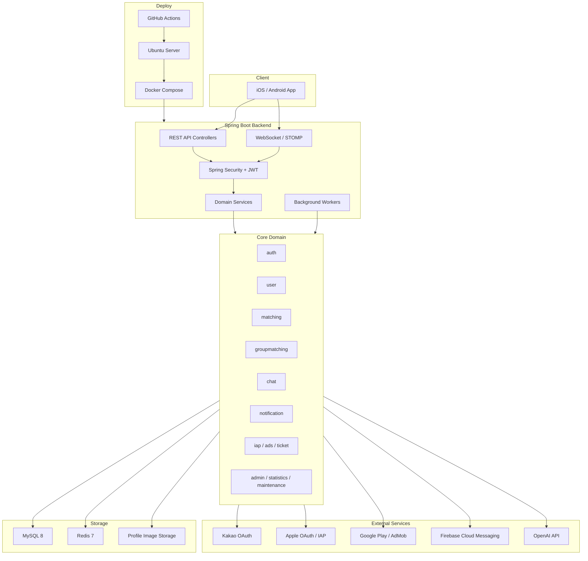

 

# 🎯 프로젝트 목표

**1. `상태 전이`가 명확한 매칭 도메인 설계**
- 친구찾기는 `PENDING`, `ACCEPTED`, `REJECTED` 상태로 요청 생명주기를 관리합니다.
- 그룹매칭은 `OPEN`, `READY_CHECK`, `QUEUE_WAITING`, `MATCHED`, `CLOSED`, `CANCELLED` 상태로 임시 팀방부터 최종 그룹채팅방까지의 흐름을 분리했습니다.

**2. `실시간 커뮤니케이션` 중심의 사용자 경험 구현**
- WebSocket/STOMP와 Redis Pub/Sub을 활용해 채팅 메시지, 읽음 처리, 채팅방 목록 갱신, 그룹매칭 이벤트를 실시간으로 전달합니다.
- REST 조회와 STOMP 구독이 같은 읽음 동기화 규칙을 따르도록 설계했습니다.

**3. `서비스 운영`까지 고려한 백엔드 구현**
- 알림함, 푸시 디바이스, FCM 발송, 알림 설정, 푸시 이벤트 추적을 분리하여 모바일 운영 흐름을 관리합니다.
- 점검 모드, 공지, 신고/차단, 통계, 관리자 API를 통해 실제 운영에 필요한 기능을 포함했습니다.

**4. `수익화 흐름`을 포함한 티켓 기반 비즈니스 로직 구현**
- 추천 조회, 친구찾기 요청, 그룹매칭 등 사용자 액션에 티켓 정책을 적용했습니다.
- Apple/Google 인앱 결제, 광고 리워드, 티켓 원장을 통해 지급/차감 이력을 추적할 수 있도록 구성했습니다.

**5. `문서화와 테스트`를 통한 품질 관리**
- 친구찾기, 그룹매칭, 채팅, 알림, 통계 API를 문서화하여 클라이언트와 백엔드 간 계약을 명확히 했습니다.
- JUnit5, Mockito, H2 기반 테스트로 주요 서비스 로직과 예외 흐름을 검증합니다.

 

# 🧩 사용 기술

- Java 17
- Spring Boot 3.4.3
- Spring Web MVC
- Spring Data JPA
- Spring Security
- JWT
- WebSocket / STOMP
- MySQL 8
- Redis 7
- Firebase Admin SDK / FCM
- Spring Mail
- Apple OAuth / Kakao OAuth
- Apple IAP / Google Play Billing Verification
- AdMob Server-Side Verification
- OpenAI API
- JUnit5
- Mockito
- H2
- Gradle
- Docker
- Docker Compose
- GitHub Actions

 

# ✏️️ 프로토타입

현재 저장소는 백엔드 중심 프로젝트이므로, 화면 이미지 대신 모바일 클라이언트와 연동되는 핵심 사용자 흐름을 기준으로 정리했습니다.

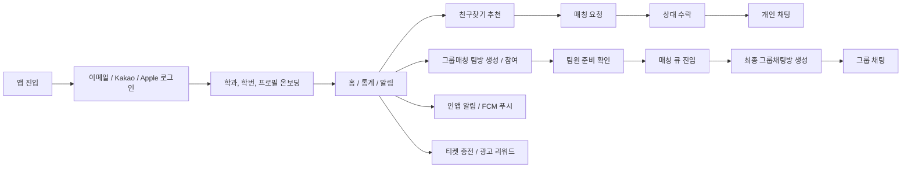

 

# 📌 주요 기능

**1. 회원 / 인증**
- 이메일 회원가입, Kakao OAuth, Apple OAuth 로그인 지원
- JWT access/refresh token 발급 및 refresh token hash 저장
- 학교 이메일 인증, 프로필 이미지 업로드, 온보딩 상태 관리

**2. 친구찾기**
- 성별, 프로필, 차단 관계, 기존 연결 상태를 고려한 추천 후보 조회
- 추천 노출 이력 기반으로 노출되지 않은 사용자에게 요청하는 행위 차단
- 요청, 수락, 거절, 재요청, 기존 채팅방 복구 처리
- 수락 시 `PERSONAL` 채팅방 생성 또는 재사용

**3. 그룹매칭**
- 2:2, 3:3 팀방 생성 및 공개/비공개 초대 코드 지원
- 팀원 입장, 준비 상태, 방장 권한, 큐 진입/이탈 관리
- 팀 크기와 성별 조건을 기반으로 상대 팀 매칭
- 매칭 성공 후 최종 그룹채팅방 생성 및 실시간 이벤트 발행

**4. 실시간 채팅**
- REST 메시지 조회/전송과 STOMP 메시지 전송 동시 지원
- 개인 채팅과 그룹 채팅의 읽음 처리 정책 분리
- 메시지별 `unreadCount`, `READ_RECEIPT`, 채팅방 목록 `ROOM_LIST_UPDATE` 제공
- Redis publish/subscribe 기반 메시지 브로드캐스팅

**5. 알림 / 푸시**
- 인앱 알림함, 미읽음 개수, 읽음/삭제 처리
- 알림 설정, quiet hours, 디바이스 토큰 등록/권한 갱신
- FCM push 발송과 `RECEIVED`, `OPENED` 이벤트 추적
- 매칭 요청, 매칭 결과, 그룹매칭 상태, 약속 리마인더, 시스템 공지 알림 타입 관리

**6. 운영 / 안전 / 수익화**
- 신고, 차단, 지원 정보 API
- 점검 모드, 공지, 관리자 기능, 통계 API
- Apple/Google 인앱 결제 검증, 환불/웹훅 처리
- AdMob 광고 리워드 검증과 티켓 지급

 

# 📚 설계

커뮤니케이션 다이어그램, 상태 다이어그램, ER 다이어그램의 순서로 설계했습니다.

- 서비스를 단순 CRUD가 아니라 `매칭`, `채팅`, `알림`, `티켓`의 상태 변화로 분리했습니다.
- 각 도메인 객체의 책임을 기준으로 서비스 계층을 나누고, 공통 인증/응답/예외 처리는 `global` 영역으로 분리했습니다.
- 모바일 클라이언트와의 계약이 중요한 기능은 별도 문서로 API 규칙과 JSON 예시를 관리했습니다.

## 1. 친구찾기 커뮤니케이션 다이어그램

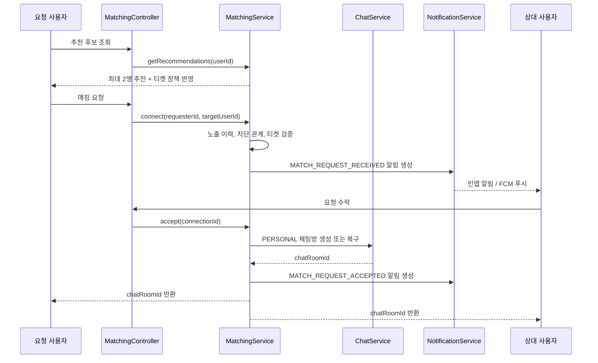

## 2. 그룹매칭 상태 다이어그램

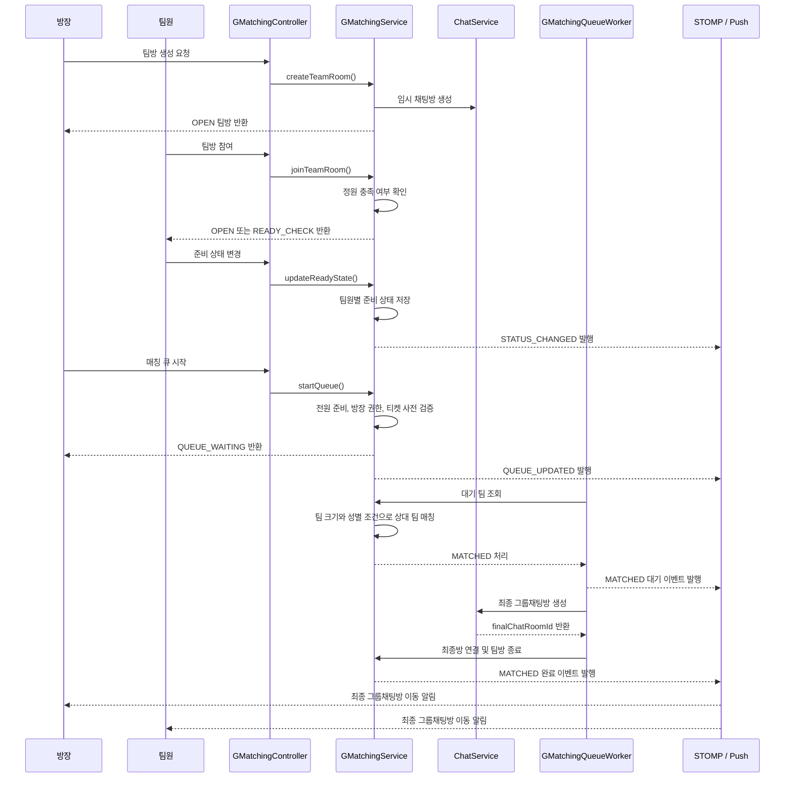

## 3. ERD

테이블 수가 많아 전체 ERD를 한 번에 펼치면 가독성이 떨어지므로, 핵심 흐름 기준으로 도메인별 ERD를 분리했습니다.

### 회원 / 인증 / 안전

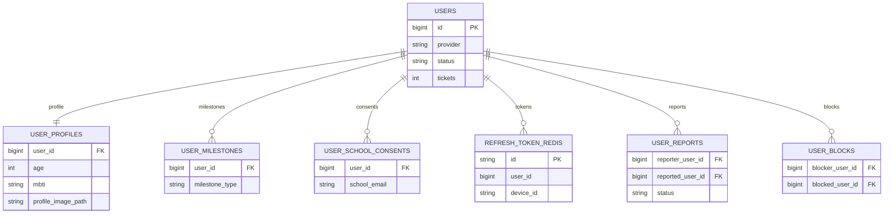

### 친구찾기 / 채팅

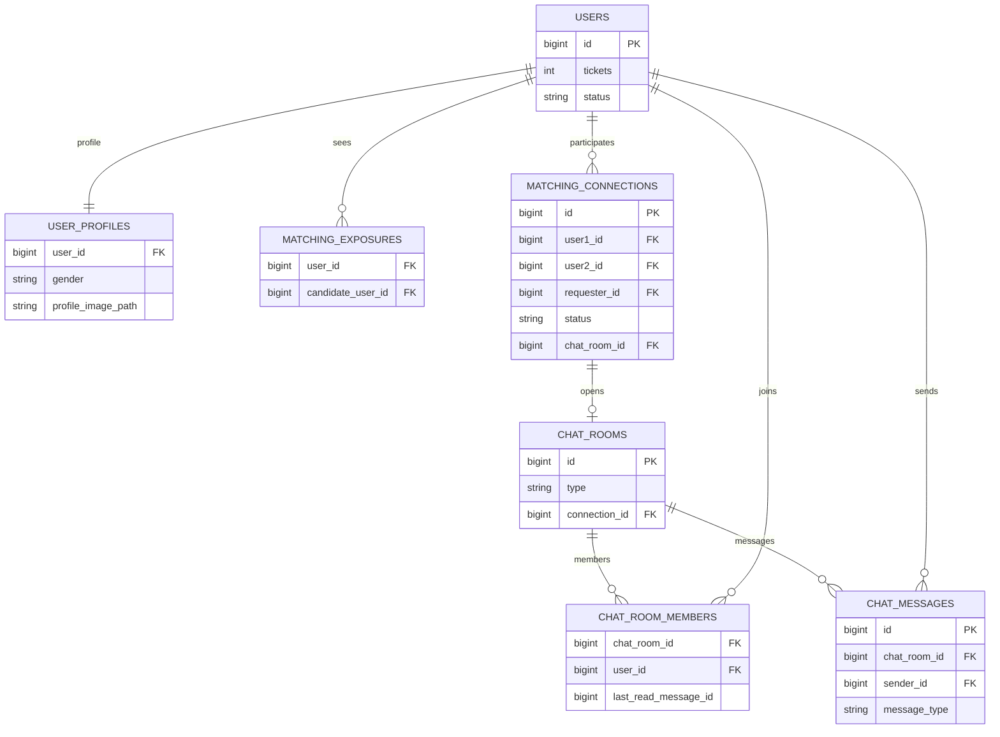

### 그룹매칭

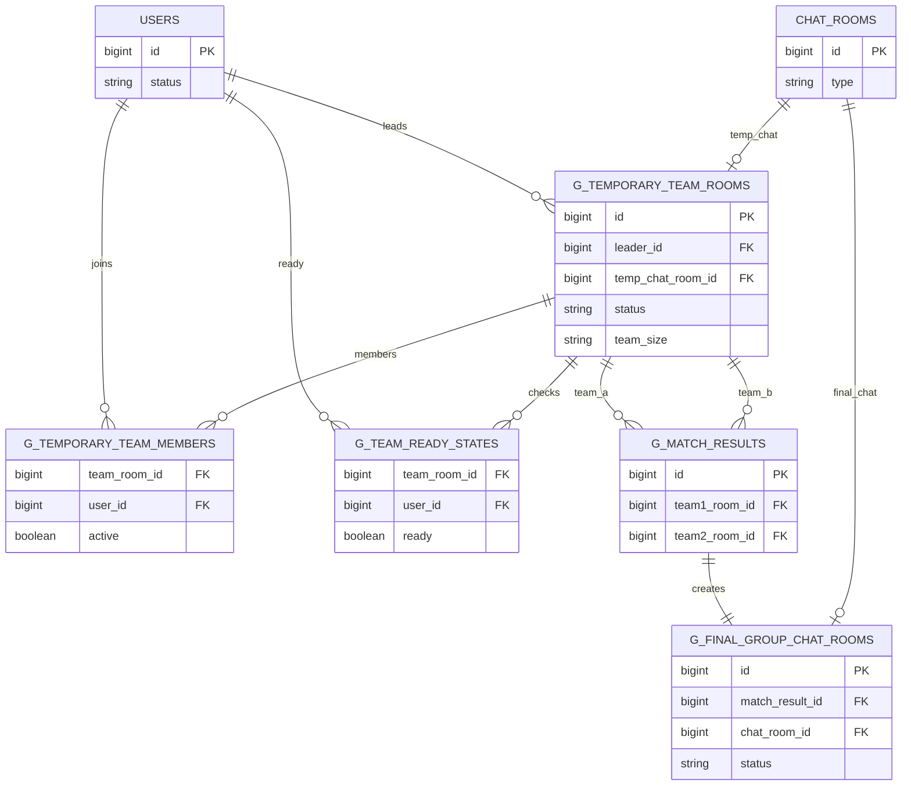

### 알림 / 푸시

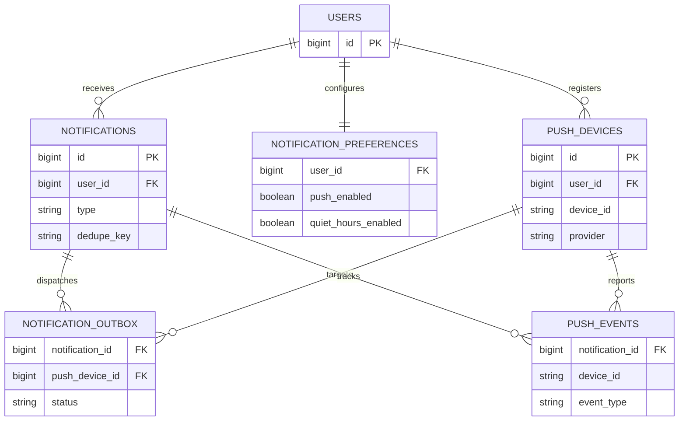

### 티켓 / 결제 / 리워드

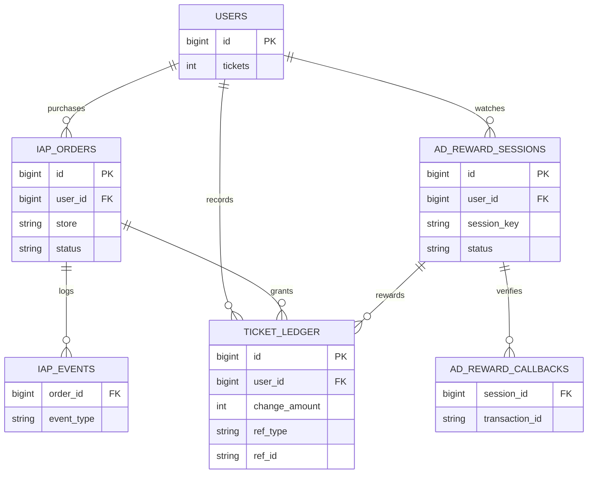

### 운영 / 분석

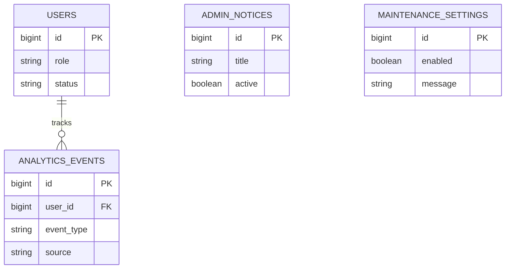

 

# 🥁 Git 브랜치 전략

프로젝트의 버전 관리 및 협업을 위해 Git-Flow 기반 전략을 사용합니다.

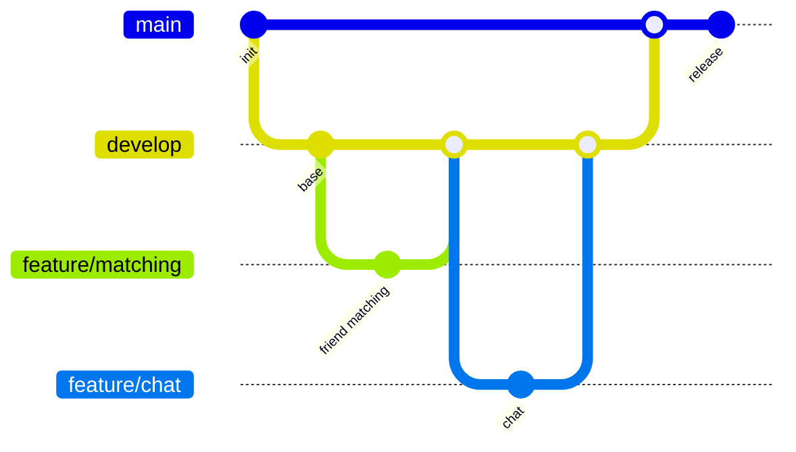

- **main**: 제품으로 출시될 수 있는 안정 버전 브랜치입니다.
- **develop**: 다음 배포 버전을 통합하는 브랜치입니다. GitHub Actions 배포 기준 브랜치로 사용합니다.
- **feature**: 기능 단위 개발 브랜치입니다. 구현과 테스트가 끝나면 `develop` 브랜치에 병합합니다.
- **release**: 배포 전 최종 검증, 문서 정리, 버그 수정을 위한 브랜치입니다.
- **hotfix**: 운영 중 발생한 긴급 버그 수정을 위한 브랜치입니다.

 

> ### AirConnect의 기록
> #### [친구찾기 명세](docs/%EC%86%8C%EA%B0%9C%ED%8C%85%20%EC%B5%9C%EC%A2%85.md) | [그룹매칭 명세](docs/%EA%B3%BC%ED%8C%85%20%EC%B5%9C%EC%A2%85.md) | [채팅 명세](docs/채팅%20최종.md) | [알림 API](docs/notification-api.md) | [통계 API](docs/statistics-api.md)  
> #### [Android 알림 계약](docs/android-notification-contract.md) | [Android 백엔드 연동](docs/Android%20백엔드%20연동.md) | [개별 보고서](docs/2026-04-21%20AirConnect%20개별보고서.md) | [주간 작업 보고서](docs/2026-04-28%20AirConnect%20주간%20작업%20보고서.md)
