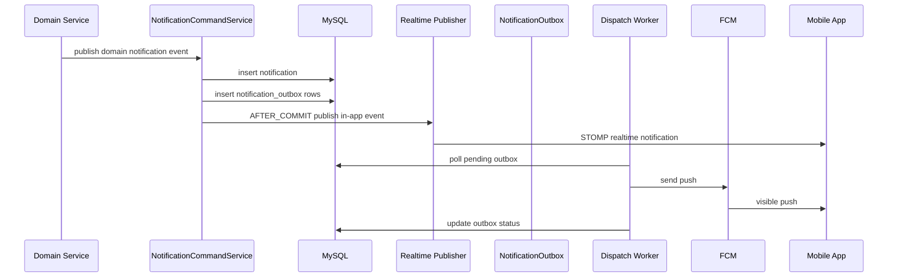

# AirConnect Notification Design

## 1. 목적

이 문서는 AirConnect 백엔드에 모바일 앱용 알림 기능을 추가하기 위한 설계서다.

- 앱이 켜져 있을 때: 앱 내 알림 센터 + 실시간 STOMP 알림
- 앱이 백그라운드/종료 상태일 때: Android FCM, iOS FCM/APNs 기반 푸시 알림
- 현재 코드에서 실제로 발생하는 비즈니스 이벤트를 기준으로 알림을 정의
- 추후 약속 리마인드, 공지, 운영 알림까지 확장 가능한 구조를 목표로 함

## 2. 현재 코드 기준 알림 이벤트 소스

현재 코드에서 알림 트리거로 연결해야 하는 핵심 메서드는 아래와 같다.

| 도메인 | 이벤트 타입 | 현재 소스 메서드 | 수신자 |
| --- | --- | --- | --- |
| 1:1 매칭 | `MATCH_REQUEST_RECEIVED` | `MatchingService.connect(...)` | 요청 대상 사용자 |
| 1:1 매칭 | `MATCH_REQUEST_ACCEPTED` | `MatchingService.acceptRequest(...)` | 최초 요청 사용자 |
| 1:1 매칭 | `MATCH_REQUEST_REJECTED` | `MatchingService.rejectRequest(...)` | 최초 요청 사용자 |
| 그룹 매칭 | `GROUP_MATCHED` | `GMatchingService.completeMatch(...)` | 최종 매칭된 양 팀 전원 |
| 채팅 | `CHAT_MESSAGE_RECEIVED` | `ChatService.saveAndPublishMessage(...)` | 발신자를 제외한 채팅방 멤버 |
| 마일스톤 | `MILESTONE_REWARDED` | `UserProfileImageService.grantMilestoneIfNotAlreadyGranted(...)` | 본인 |
| 마일스톤 | `MILESTONE_REWARDED` | `VerificationService.grantMilestoneIfNotAlreadyGranted(...)` | 본인 |
| 그룹 매칭 | `TEAM_READY_REQUIRED` | `GMatchingService.joinTeamRoomInternal(...)` | 팀원 전원 |
| 그룹 매칭 | `TEAM_ALL_READY` | `GMatchingService.updateReadyState(...)` 이후 추가 판단 필요 | 방장 1명 우선 |
| 그룹 매칭 | `TEAM_ROOM_CANCELLED` | `GMatchingService.cancelTeamRoom(...)` | 해산된 팀의 멤버 |
| 그룹 매칭 | `TEAM_MEMBER_JOINED` | `GMatchingService.joinTeamRoomInternal(...)` | 기존 팀원 |
| 그룹 매칭 | `TEAM_MEMBER_LEFT` | `GMatchingService.leaveTeamRoom(...)` | 남아있는 팀원 |
| 일정/리마인드 | `APPOINTMENT_REMINDER_1H`, `APPOINTMENT_REMINDER_10M` | 현재 코드 없음 | 약속 참여자 |

## 3. 이벤트 우선순위

### P0

- `MATCH_REQUEST_RECEIVED`
- `MATCH_REQUEST_ACCEPTED`
- `MATCH_REQUEST_REJECTED`
- `GROUP_MATCHED`
- `CHAT_MESSAGE_RECEIVED`
- `MILESTONE_REWARDED`

### P1

- `TEAM_READY_REQUIRED`
- `TEAM_ALL_READY`
- `TEAM_ROOM_CANCELLED`
- `TEAM_MEMBER_JOINED`
- `TEAM_MEMBER_LEFT`

### P2

- `APPOINTMENT_REMINDER_1H`
- `APPOINTMENT_REMINDER_10M`
- 공지/운영 알림

## 4. 알림 도메인 모델

알림 도메인은 아래 4개 엔티티로 구성한다.

### 4.1 Notification

사용자 알림 센터에 저장되는 실제 알림 레코드다.

- 수신자 1명 기준으로 1행 생성
- 앱 내 목록 조회, 읽음 처리, deep link 이동의 기준
- 푸시 발송 성공 여부와 무관하게 먼저 저장

### 4.2 PushDevice

디바이스별 푸시 토큰과 권한 상태를 저장한다.

- 기존 `RefreshToken.deviceId`와 같은 `deviceId`를 재사용
- Android/iOS 모두 같은 API로 등록
- iOS도 서버 발송은 우선 FCM으로 통일
- 필요 시 direct APNs 발송으로 확장 가능

### 4.3 NotificationPreference

사용자 알림 설정이다.

- 전체 푸시 on/off
- 앱 내 알림 on/off
- 카테고리별 허용 여부
- 추후 방해금지 시간대까지 확장

### 4.4 NotificationOutbox

푸시 발송 작업 큐다.

- 알림 저장과 푸시 발송을 분리
- 재시도, 실패 이력, provider message id 기록
- 트랜잭션 내 즉시 발송 대신 워커가 안전하게 처리

## 5. 권장 패키지 구조

```text
univ.airconnect.notification
  controller
    NotificationController.java
    PushDeviceController.java
    NotificationPreferenceController.java
  domain
    entity
      Notification.java
      PushDevice.java
      NotificationPreference.java
      NotificationOutbox.java
    type
      NotificationType.java
      NotificationCategory.java
      NotificationDeliveryStatus.java
      PushPlatform.java
      PushProvider.java
  dto
    request
    response
  repository
  service
    NotificationCommandService.java
    NotificationQueryService.java
    PushDeviceService.java
    NotificationPreferenceService.java
    NotificationRealtimePublisher.java
    NotificationOutboxService.java
    NotificationDispatchWorker.java
    FcmPushSender.java
  event
    MatchingNotificationEvent.java
    ChatNotificationEvent.java
    MilestoneNotificationEvent.java
```

## 6. 처리 흐름



### 핵심 원칙

- 알림 저장과 푸시 발송은 분리한다.
- 비즈니스 트랜잭션이 푸시 실패 때문에 롤백되면 안 된다.
- 앱 내 알림과 푸시는 같은 `Notification` 원본을 공유한다.
- 푸시 중복 방지를 위해 `dedupeKey`를 둔다.
- 채팅 푸시는 현재 같은 방을 보고 있는 사용자는 억제한다.

## 7. 실시간 전송 전략

현재 코드는 `/sub/chat/room/{roomId}`, `/sub/matching/team-room/{teamRoomId}` 구조를 사용한다.

알림 전용 채널은 아래 두 가지 중 하나를 선택할 수 있다.

### 최소 변경안

- subscribe: `/sub/notifications/user/{userId}`
- `StompHandler`에서 path의 `userId`와 인증 사용자 일치 여부 검증

### 권장안

- `WebSocketConfig`에 `setUserDestinationPrefix("/user")` 추가
- subscribe: `/user/queue/notifications`
- unread count: `/user/queue/notifications/unread-count`
- 서버는 `convertAndSendToUser(userId, "/queue/notifications", payload)` 사용

권장안이 장기적으로 더 안전하다.

## 8. 푸시 전략

### Android

- 클라이언트에서 FCM registration token 획득
- `POST /api/v1/push/devices`로 서버 등록
- 서버는 Firebase Admin SDK로 직접 FCM 발송

### iOS

- 앱에서 APNs 권한 요청
- Firebase Messaging이 APNs token을 FCM registration token에 매핑
- 클라이언트는 FCM registration token을 서버에 등록
- 서버는 1차 구현에서는 FCM으로 발송
- Firebase가 APNs로 전달

### direct APNs

- 향후 특정 iOS 전용 기능이 필요하면 `PushProvider.APNS`를 추가
- 1차 구현에서는 불필요

### visible push vs silent push

- `MATCH_REQUEST_RECEIVED`, `GROUP_MATCHED`, `CHAT_MESSAGE_RECEIVED`는 visible push 우선
- silent/background push는 unread badge 동기화나 캐시 갱신 용도로만 사용
- critical event 전달을 background push에 의존하지 않는다

## 9. DB 스키마

아래 DDL은 MySQL 8 기준이다.

### 9.1 notification_preferences

```sql
CREATE TABLE notification_preferences (
    user_id BIGINT NOT NULL PRIMARY KEY,
    push_enabled TINYINT(1) NOT NULL DEFAULT 1,
    in_app_enabled TINYINT(1) NOT NULL DEFAULT 1,
    match_request_enabled TINYINT(1) NOT NULL DEFAULT 1,
    match_result_enabled TINYINT(1) NOT NULL DEFAULT 1,
    group_matching_enabled TINYINT(1) NOT NULL DEFAULT 1,
    chat_message_enabled TINYINT(1) NOT NULL DEFAULT 1,
    milestone_enabled TINYINT(1) NOT NULL DEFAULT 1,
    reminder_enabled TINYINT(1) NOT NULL DEFAULT 1,
    quiet_hours_enabled TINYINT(1) NOT NULL DEFAULT 0,
    quiet_hours_start TIME NULL,
    quiet_hours_end TIME NULL,
    timezone VARCHAR(50) NOT NULL DEFAULT 'Asia/Seoul',
    created_at DATETIME(6) NOT NULL,
    updated_at DATETIME(6) NOT NULL,
    CONSTRAINT fk_notification_preferences_user
        FOREIGN KEY (user_id) REFERENCES users(id)
);
```

### 9.2 push_devices

```sql
CREATE TABLE push_devices (
    id BIGINT NOT NULL AUTO_INCREMENT PRIMARY KEY,
    user_id BIGINT NOT NULL,
    device_id VARCHAR(120) NOT NULL,
    platform VARCHAR(20) NOT NULL,
    provider VARCHAR(20) NOT NULL,
    push_token VARCHAR(512) NOT NULL,
    apns_token VARCHAR(512) NULL,
    notification_permission_granted TINYINT(1) NOT NULL DEFAULT 1,
    active TINYINT(1) NOT NULL DEFAULT 1,
    app_version VARCHAR(50) NULL,
    os_version VARCHAR(50) NULL,
    locale VARCHAR(20) NULL,
    timezone VARCHAR(50) NULL,
    last_seen_at DATETIME(6) NULL,
    last_token_refreshed_at DATETIME(6) NOT NULL,
    deactivated_at DATETIME(6) NULL,
    created_at DATETIME(6) NOT NULL,
    updated_at DATETIME(6) NOT NULL,
    CONSTRAINT uk_push_devices_user_device UNIQUE (user_id, device_id),
    CONSTRAINT uk_push_devices_provider_token UNIQUE (provider, push_token),
    KEY idx_push_devices_user_active (user_id, active),
    KEY idx_push_devices_token_refreshed (last_token_refreshed_at),
    CONSTRAINT fk_push_devices_user
        FOREIGN KEY (user_id) REFERENCES users(id)
);
```

### 9.3 notifications

```sql
CREATE TABLE notifications (
    id BIGINT NOT NULL AUTO_INCREMENT PRIMARY KEY,
    user_id BIGINT NOT NULL,
    type VARCHAR(50) NOT NULL,
    category VARCHAR(30) NOT NULL,
    title VARCHAR(120) NOT NULL,
    body VARCHAR(500) NOT NULL,
    deeplink VARCHAR(255) NULL,
    actor_user_id BIGINT NULL,
    image_url VARCHAR(500) NULL,
    payload_json JSON NOT NULL,
    dedupe_key VARCHAR(120) NULL,
    read_at DATETIME(6) NULL,
    deleted_at DATETIME(6) NULL,
    created_at DATETIME(6) NOT NULL,
    CONSTRAINT uk_notifications_user_dedupe UNIQUE (user_id, dedupe_key),
    KEY idx_notifications_user_created (user_id, created_at DESC),
    KEY idx_notifications_user_read (user_id, read_at, created_at DESC),
    KEY idx_notifications_type_created (type, created_at DESC),
    CONSTRAINT fk_notifications_user
        FOREIGN KEY (user_id) REFERENCES users(id),
    CONSTRAINT fk_notifications_actor_user
        FOREIGN KEY (actor_user_id) REFERENCES users(id)
);
```

### 9.4 notification_outbox

```sql
CREATE TABLE notification_outbox (
    id BIGINT NOT NULL AUTO_INCREMENT PRIMARY KEY,
    notification_id BIGINT NOT NULL,
    user_id BIGINT NOT NULL,
    push_device_id BIGINT NOT NULL,
    provider VARCHAR(20) NOT NULL,
    status VARCHAR(20) NOT NULL,
    target_token VARCHAR(512) NOT NULL,
    title VARCHAR(120) NOT NULL,
    body VARCHAR(500) NOT NULL,
    data_json JSON NOT NULL,
    attempt_count INT NOT NULL DEFAULT 0,
    next_attempt_at DATETIME(6) NOT NULL,
    claimed_at DATETIME(6) NULL,
    sent_at DATETIME(6) NULL,
    provider_message_id VARCHAR(200) NULL,
    last_error_code VARCHAR(100) NULL,
    last_error_message VARCHAR(1000) NULL,
    created_at DATETIME(6) NOT NULL,
    updated_at DATETIME(6) NOT NULL,
    CONSTRAINT uk_notification_outbox_notification_device
        UNIQUE (notification_id, push_device_id),
    KEY idx_notification_outbox_status_next_attempt (status, next_attempt_at),
    KEY idx_notification_outbox_user_created (user_id, created_at DESC),
    CONSTRAINT fk_notification_outbox_notification
        FOREIGN KEY (notification_id) REFERENCES notifications(id),
    CONSTRAINT fk_notification_outbox_user
        FOREIGN KEY (user_id) REFERENCES users(id),
    CONSTRAINT fk_notification_outbox_push_device
        FOREIGN KEY (push_device_id) REFERENCES push_devices(id)
);
```

## 10. Enum 제안

### NotificationType

```text
MATCH_REQUEST_RECEIVED
MATCH_REQUEST_ACCEPTED
MATCH_REQUEST_REJECTED
GROUP_MATCHED
CHAT_MESSAGE_RECEIVED
MILESTONE_REWARDED
TEAM_READY_REQUIRED
TEAM_ALL_READY
TEAM_ROOM_CANCELLED
TEAM_MEMBER_JOINED
TEAM_MEMBER_LEFT
APPOINTMENT_REMINDER_1H
APPOINTMENT_REMINDER_10M
SYSTEM_ANNOUNCEMENT
```

### NotificationCategory

```text
MATCHING
GROUP_MATCHING
CHAT
MILESTONE
REMINDER
SYSTEM
```

### NotificationDeliveryStatus

```text
PENDING
SENT
FAILED
SKIPPED
```

### PushPlatform

```text
IOS
ANDROID
```

### PushProvider

```text
FCM
APNS
```

## 11. dedupe key 규칙

중복 알림 방지를 위해 아래 규칙을 사용한다.

| 이벤트 | dedupeKey 예시 |
| --- | --- |
| `MATCH_REQUEST_RECEIVED` | `match-request:312:received` |
| `MATCH_REQUEST_ACCEPTED` | `match-request:312:accepted` |
| `MATCH_REQUEST_REJECTED` | `match-request:312:rejected` |
| `GROUP_MATCHED` | `group-match:91:matched` |
| `CHAT_MESSAGE_RECEIVED` | `chat-message:5512:received` |
| `MILESTONE_REWARDED` | `milestone:104:EMAIL_VERIFIED:granted` |
| `TEAM_READY_REQUIRED` | `team-room:44:ready-required` |
| `TEAM_ALL_READY` | `team-room:44:all-ready` |
| `TEAM_ROOM_CANCELLED` | `team-room:44:cancelled` |

## 12. API 명세

모든 응답은 기존 프로젝트의 `ApiResponse<T>` 포맷을 사용한다.

### 12.1 푸시 디바이스 등록/갱신

- `POST /api/v1/push/devices`
- 설명: deviceId 기준 upsert

#### Request

```json
{
  "deviceId": "ios-3d8192df-b9d1-4c4c-92a9-f497d7d1aa11",
  "platform": "IOS",
  "provider": "FCM",
  "pushToken": "fcm-registration-token",
  "apnsToken": "optional-apns-token",
  "notificationPermissionGranted": true,
  "appVersion": "1.0.0",
  "osVersion": "17.4.1",
  "locale": "ko-KR",
  "timezone": "Asia/Seoul"
}
```

#### Response

```json
{
  "success": true,
  "data": {
    "deviceId": "ios-3d8192df-b9d1-4c4c-92a9-f497d7d1aa11",
    "platform": "IOS",
    "provider": "FCM",
    "active": true,
    "notificationPermissionGranted": true,
    "registeredAt": "2026-03-26T21:10:11+09:00"
  },
  "traceId": "trace-id"
}
```

### 12.2 푸시 디바이스 비활성화

- `DELETE /api/v1/push/devices/{deviceId}`
- 설명: 로그아웃 또는 앱 삭제 대응

#### Response

```json
{
  "success": true,
  "data": null,
  "traceId": "trace-id"
}
```

### 12.3 알림 목록 조회

- `GET /api/v1/notifications?cursor={notificationId}&size=20&unreadOnly=false&type=CHAT_MESSAGE_RECEIVED`

#### Response

```json
{
  "success": true,
  "data": {
    "items": [
      {
        "id": 1041,
        "type": "MATCH_REQUEST_RECEIVED",
        "category": "MATCHING",
        "title": "새 매칭 요청",
        "body": "민수가 연결 요청을 보냈어요.",
        "deeplink": "airconnect://matching/requests",
        "imageUrl": null,
        "actor": {
          "userId": 22,
          "nickname": "민수",
          "profileImageUrl": "https://cdn.example.com/profile/22.jpg"
        },
        "payload": {
          "connectionId": 312,
          "requesterUserId": 22
        },
        "read": false,
        "readAt": null,
        "createdAt": "2026-03-26T21:10:11+09:00"
      }
    ],
    "nextCursor": 1041,
    "hasNext": true
  },
  "traceId": "trace-id"
}
```

### 12.4 unread count 조회

- `GET /api/v1/notifications/unread-count`

#### Response

```json
{
  "success": true,
  "data": {
    "unreadCount": 7
  },
  "traceId": "trace-id"
}
```

### 12.5 단건 읽음 처리

- `PATCH /api/v1/notifications/{notificationId}/read`

#### Response

```json
{
  "success": true,
  "data": {
    "notificationId": 1041,
    "read": true,
    "readAt": "2026-03-26T21:12:03+09:00"
  },
  "traceId": "trace-id"
}
```

### 12.6 전체 읽음 처리

- `PATCH /api/v1/notifications/read-all`

#### Response

```json
{
  "success": true,
  "data": {
    "updatedCount": 7,
    "readAt": "2026-03-26T21:12:44+09:00"
  },
  "traceId": "trace-id"
}
```

### 12.7 알림 설정 조회

- `GET /api/v1/notification-preferences`

#### Response

```json
{
  "success": true,
  "data": {
    "pushEnabled": true,
    "inAppEnabled": true,
    "matchRequestEnabled": true,
    "matchResultEnabled": true,
    "groupMatchingEnabled": true,
    "chatMessageEnabled": true,
    "milestoneEnabled": true,
    "reminderEnabled": true,
    "quietHoursEnabled": false,
    "quietHoursStart": null,
    "quietHoursEnd": null,
    "timezone": "Asia/Seoul"
  },
  "traceId": "trace-id"
}
```

### 12.8 알림 설정 수정

- `PATCH /api/v1/notification-preferences`

#### Request

```json
{
  "pushEnabled": true,
  "chatMessageEnabled": false,
  "quietHoursEnabled": true,
  "quietHoursStart": "23:00:00",
  "quietHoursEnd": "08:00:00",
  "timezone": "Asia/Seoul"
}
```

#### Response

```json
{
  "success": true,
  "data": {
    "pushEnabled": true,
    "chatMessageEnabled": false,
    "quietHoursEnabled": true,
    "quietHoursStart": "23:00:00",
    "quietHoursEnd": "08:00:00",
    "timezone": "Asia/Seoul"
  },
  "traceId": "trace-id"
}
```

## 13. STOMP 명세

### 권장 subscribe 경로

- `/user/queue/notifications`
- `/user/queue/notifications/unread-count`

### 실시간 알림 payload

```json
{
  "id": 1041,
  "type": "MATCH_REQUEST_RECEIVED",
  "category": "MATCHING",
  "title": "새 매칭 요청",
  "body": "민수가 연결 요청을 보냈어요.",
  "deeplink": "airconnect://matching/requests",
  "imageUrl": null,
  "actor": {
    "userId": 22,
    "nickname": "민수",
    "profileImageUrl": "https://cdn.example.com/profile/22.jpg"
  },
  "payload": {
    "connectionId": 312,
    "requesterUserId": 22
  },
  "read": false,
  "readAt": null,
  "createdAt": "2026-03-26T21:10:11+09:00"
}
```

### unread count payload

```json
{
  "unreadCount": 7,
  "occurredAt": "2026-03-26T21:10:11+09:00"
}
```

## 14. 이벤트별 payload 예시

아래 payload는 `notifications.payload_json`과 STOMP/앱 내부 공통 payload 기준이다.

### 14.1 MATCH_REQUEST_RECEIVED

```json
{
  "type": "MATCH_REQUEST_RECEIVED",
  "category": "MATCHING",
  "title": "새 매칭 요청",
  "body": "민수가 연결 요청을 보냈어요.",
  "deeplink": "airconnect://matching/requests",
  "actor": {
    "userId": 22,
    "nickname": "민수",
    "profileImageUrl": "https://cdn.example.com/profile/22.jpg"
  },
  "payload": {
    "connectionId": 312,
    "requesterUserId": 22,
    "targetUserId": 31
  }
}
```

### 14.2 MATCH_REQUEST_ACCEPTED

```json
{
  "type": "MATCH_REQUEST_ACCEPTED",
  "category": "MATCHING",
  "title": "매칭 수락",
  "body": "지수가 요청을 수락했어요. 지금 바로 채팅을 시작해보세요.",
  "deeplink": "airconnect://chat/rooms/88",
  "actor": {
    "userId": 31,
    "nickname": "지수",
    "profileImageUrl": "https://cdn.example.com/profile/31.jpg"
  },
  "payload": {
    "connectionId": 312,
    "chatRoomId": 88,
    "acceptedUserId": 31
  }
}
```

### 14.3 MATCH_REQUEST_REJECTED

```json
{
  "type": "MATCH_REQUEST_REJECTED",
  "category": "MATCHING",
  "title": "매칭 거절",
  "body": "지수가 이번 요청을 거절했어요.",
  "deeplink": "airconnect://matching/requests",
  "actor": {
    "userId": 31,
    "nickname": "지수",
    "profileImageUrl": "https://cdn.example.com/profile/31.jpg"
  },
  "payload": {
    "connectionId": 312,
    "rejectedUserId": 31
  }
}
```

### 14.4 GROUP_MATCHED

```json
{
  "type": "GROUP_MATCHED",
  "category": "GROUP_MATCHING",
  "title": "그룹 매칭 성사",
  "body": "상대 팀과 매칭됐어요. 최종 단톡방으로 이동해보세요.",
  "deeplink": "airconnect://group-chat/final/91",
  "actor": null,
  "payload": {
    "teamRoomId": 44,
    "finalGroupRoomId": 91,
    "finalChatRoomId": 205,
    "memberCount": 4
  }
}
```

### 14.5 CHAT_MESSAGE_RECEIVED

```json
{
  "type": "CHAT_MESSAGE_RECEIVED",
  "category": "CHAT",
  "title": "새 메시지",
  "body": "민수: 오늘 시간 괜찮아요?",
  "deeplink": "airconnect://chat/rooms/88",
  "actor": {
    "userId": 22,
    "nickname": "민수",
    "profileImageUrl": "https://cdn.example.com/profile/22.jpg"
  },
  "payload": {
    "chatRoomId": 88,
    "messageId": 5512,
    "messageType": "TEXT",
    "preview": "오늘 시간 괜찮아요?"
  }
}
```

### 14.6 MILESTONE_REWARDED

```json
{
  "type": "MILESTONE_REWARDED",
  "category": "MILESTONE",
  "title": "마일스톤 달성",
  "body": "이메일 인증 완료. 티켓 1장이 지급됐어요.",
  "deeplink": "airconnect://me/milestones",
  "actor": null,
  "payload": {
    "milestoneType": "EMAIL_VERIFIED",
    "rewardTickets": 1,
    "currentTickets": 101
  }
}
```

### 14.7 TEAM_READY_REQUIRED

```json
{
  "type": "TEAM_READY_REQUIRED",
  "category": "GROUP_MATCHING",
  "title": "팀 준비 확인 필요",
  "body": "팀원이 모두 모였어요. 준비 상태를 체크해주세요.",
  "deeplink": "airconnect://matching/team-rooms/44",
  "actor": null,
  "payload": {
    "teamRoomId": 44,
    "teamSize": "TWO",
    "currentMemberCount": 2
  }
}
```

### 14.8 TEAM_ALL_READY

```json
{
  "type": "TEAM_ALL_READY",
  "category": "GROUP_MATCHING",
  "title": "모든 팀원이 준비 완료",
  "body": "지금 매칭을 시작할 수 있어요.",
  "deeplink": "airconnect://matching/team-rooms/44",
  "actor": null,
  "payload": {
    "teamRoomId": 44,
    "leaderUserId": 10,
    "allMembersReady": true
  }
}
```

### 14.9 TEAM_ROOM_CANCELLED

```json
{
  "type": "TEAM_ROOM_CANCELLED",
  "category": "GROUP_MATCHING",
  "title": "팀 방이 해산됐어요",
  "body": "방장이 팀 방을 해산했어요.",
  "deeplink": "airconnect://matching/team-rooms",
  "actor": {
    "userId": 10,
    "nickname": "방장",
    "profileImageUrl": "https://cdn.example.com/profile/10.jpg"
  },
  "payload": {
    "teamRoomId": 44,
    "cancelledByUserId": 10
  }
}
```

### 14.10 TEAM_MEMBER_JOINED

```json
{
  "type": "TEAM_MEMBER_JOINED",
  "category": "GROUP_MATCHING",
  "title": "새 팀원 입장",
  "body": "수연이 팀에 참여했어요.",
  "deeplink": "airconnect://matching/team-rooms/44",
  "actor": {
    "userId": 45,
    "nickname": "수연",
    "profileImageUrl": "https://cdn.example.com/profile/45.jpg"
  },
  "payload": {
    "teamRoomId": 44,
    "joinedUserId": 45,
    "currentMemberCount": 2
  }
}
```

### 14.11 TEAM_MEMBER_LEFT

```json
{
  "type": "TEAM_MEMBER_LEFT",
  "category": "GROUP_MATCHING",
  "title": "팀원 이탈",
  "body": "수연이 팀에서 나갔어요.",
  "deeplink": "airconnect://matching/team-rooms/44",
  "actor": {
    "userId": 45,
    "nickname": "수연",
    "profileImageUrl": "https://cdn.example.com/profile/45.jpg"
  },
  "payload": {
    "teamRoomId": 44,
    "leftUserId": 45,
    "currentMemberCount": 1
  }
}
```

### 14.12 APPOINTMENT_REMINDER_1H

```json
{
  "type": "APPOINTMENT_REMINDER_1H",
  "category": "REMINDER",
  "title": "약속 1시간 전",
  "body": "한강 카페 약속이 1시간 뒤에 시작돼요.",
  "deeplink": "airconnect://appointments/9001",
  "actor": null,
  "payload": {
    "appointmentId": 9001,
    "chatRoomId": 88,
    "startAt": "2026-03-27T19:00:00+09:00",
    "reminderOffsetMinutes": 60
  }
}
```

### 14.13 APPOINTMENT_REMINDER_10M

```json
{
  "type": "APPOINTMENT_REMINDER_10M",
  "category": "REMINDER",
  "title": "약속 10분 전",
  "body": "한강 카페 약속이 곧 시작돼요.",
  "deeplink": "airconnect://appointments/9001",
  "actor": null,
  "payload": {
    "appointmentId": 9001,
    "chatRoomId": 88,
    "startAt": "2026-03-27T19:00:00+09:00",
    "reminderOffsetMinutes": 10
  }
}
```

## 15. FCM 발송 payload 예시

서버 내부 워커는 `Notification`을 읽어 아래와 같은 FCM 메시지로 변환한다.

```json
{
  "token": "fcm-registration-token",
  "notification": {
    "title": "새 매칭 요청",
    "body": "민수가 연결 요청을 보냈어요."
  },
  "data": {
    "type": "MATCH_REQUEST_RECEIVED",
    "notificationId": "1041",
    "deeplink": "airconnect://matching/requests",
    "connectionId": "312",
    "requesterUserId": "22"
  },
  "android": {
    "priority": "high",
    "notification": {
      "channelId": "matching",
      "clickAction": "OPEN_NOTIFICATION"
    }
  },
  "apns": {
    "headers": {
      "apns-push-type": "alert",
      "apns-priority": "10"
    },
    "payload": {
      "aps": {
        "sound": "default",
        "badge": 7,
        "category": "MATCHING"
      }
    }
  }
}
```

## 16. 구현 시 이벤트 발행 지점

### 16.1 MatchingService

- `connect(...)`
  - 새 `MatchingConnection` 저장 직후 `MATCH_REQUEST_RECEIVED`
- `acceptRequest(...)`
  - `connection.accept(room.getId())` 직후 `MATCH_REQUEST_ACCEPTED`
- `rejectRequest(...)`
  - `connection.reject()` 직후 `MATCH_REQUEST_REJECTED`

### 16.2 GMatchingService

- `joinTeamRoomInternal(...)`
  - 멤버 입장 직후 `TEAM_MEMBER_JOINED`
  - `teamRoom.isFull()` 후 `enterReadyCheck(...)` 진입 시 `TEAM_READY_REQUIRED`
- `updateReadyState(...)`
  - ready 변경 후 전원 ready가 되면 `TEAM_ALL_READY`
- `cancelTeamRoom(...)`
  - `teamRoom.cancel(...)` 직후 `TEAM_ROOM_CANCELLED`
- `leaveTeamRoom(...)`
  - 멤버 이탈 직후 `TEAM_MEMBER_LEFT`
- `completeMatch(...)`
  - `finalGroupChatRoom` 생성 직후 `GROUP_MATCHED`
  - 기존 `matchingPushService.notifyMatched(...)`는 `NotificationCommandService` 호출로 대체 권장

### 16.3 ChatService

- `saveAndPublishMessage(...)`
  - 메시지 저장 직후 `CHAT_MESSAGE_RECEIVED`
  - sender 본인 제외
  - 시스템 메시지 `ENTER`, `EXIT`는 push 기본 비활성화

### 16.4 UserProfileImageService / VerificationService

- 마일스톤 저장 + `user.addTickets(1)` 직후 `MILESTONE_REWARDED`

## 17. push 억제 규칙

- 자기 자신에게는 push를 보내지 않는다.
- `CHAT_MESSAGE_RECEIVED`는 수신자가 현재 같은 `roomId`를 보고 있으면 push를 생략한다.
- `TEAM_MEMBER_JOINED`, `TEAM_MEMBER_LEFT`는 기본 push off, 인앱 알림 on 권장
- 설정상 해당 카테고리 push가 꺼져 있으면 outbox를 만들지 않는다.
- 설정상 앱 내 알림이 꺼져 있어도 critical event는 푸시만 발송 가능해야 한다.

## 18. 재시도 정책

- 1차 실패: 1분 후 재시도
- 2차 실패: 5분 후 재시도
- 3차 실패: 30분 후 재시도
- 최대 3회 후 `FAILED`
- FCM 응답이 invalid token이면 `push_devices.active = false` 처리

## 19. 구현 순서

### 1단계

- `notification`, `push_devices`, `notification_preferences`, `notification_outbox` 테이블 추가
- 알림 조회/읽음 API 구현
- push device 등록 API 구현

### 2단계

- `MATCH_REQUEST_RECEIVED`
- `MATCH_REQUEST_ACCEPTED`
- `MATCH_REQUEST_REJECTED`
- `GROUP_MATCHED`
- `MILESTONE_REWARDED`

### 3단계

- `CHAT_MESSAGE_RECEIVED`
- 현재 채팅방 열람 중 push 억제
- unread count STOMP 이벤트 추가

### 4단계

- `TEAM_READY_REQUIRED`
- `TEAM_ALL_READY`
- `TEAM_ROOM_CANCELLED`
- `TEAM_MEMBER_JOINED`
- `TEAM_MEMBER_LEFT`

### 5단계

- 약속 도메인 추가
- `APPOINTMENT_REMINDER_1H`
- `APPOINTMENT_REMINDER_10M`

## 20. 결론

이 설계의 핵심은 아래 세 가지다.

- 알림 센터 저장과 푸시 발송을 분리한다.
- 현재 코드의 실제 이벤트 메서드에 정확히 연결한다.
- iOS/Android를 같은 등록 API와 같은 outbox 흐름으로 처리하되, 서버 발송은 우선 FCM으로 통일한다.
