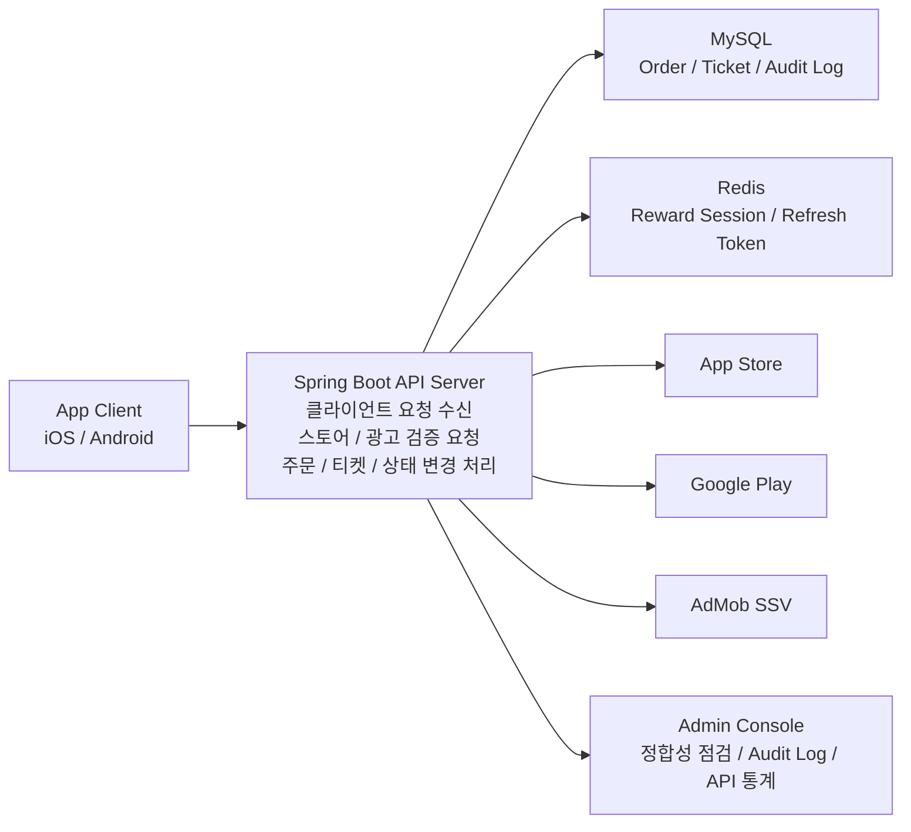
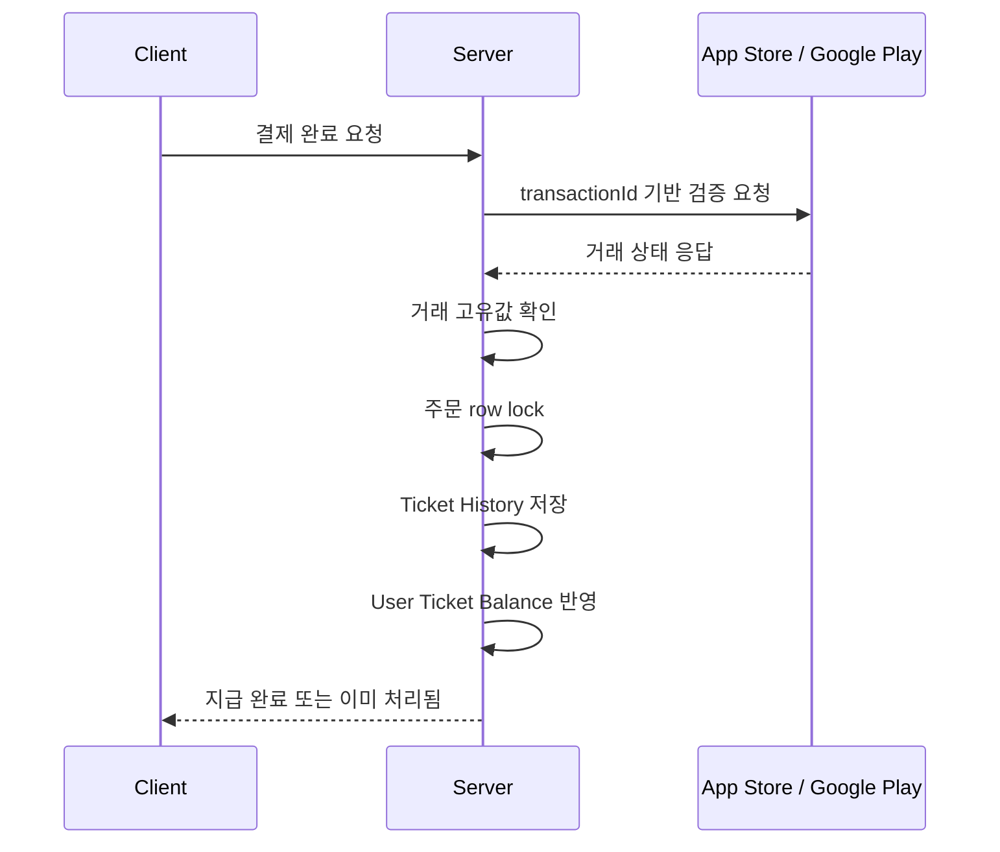
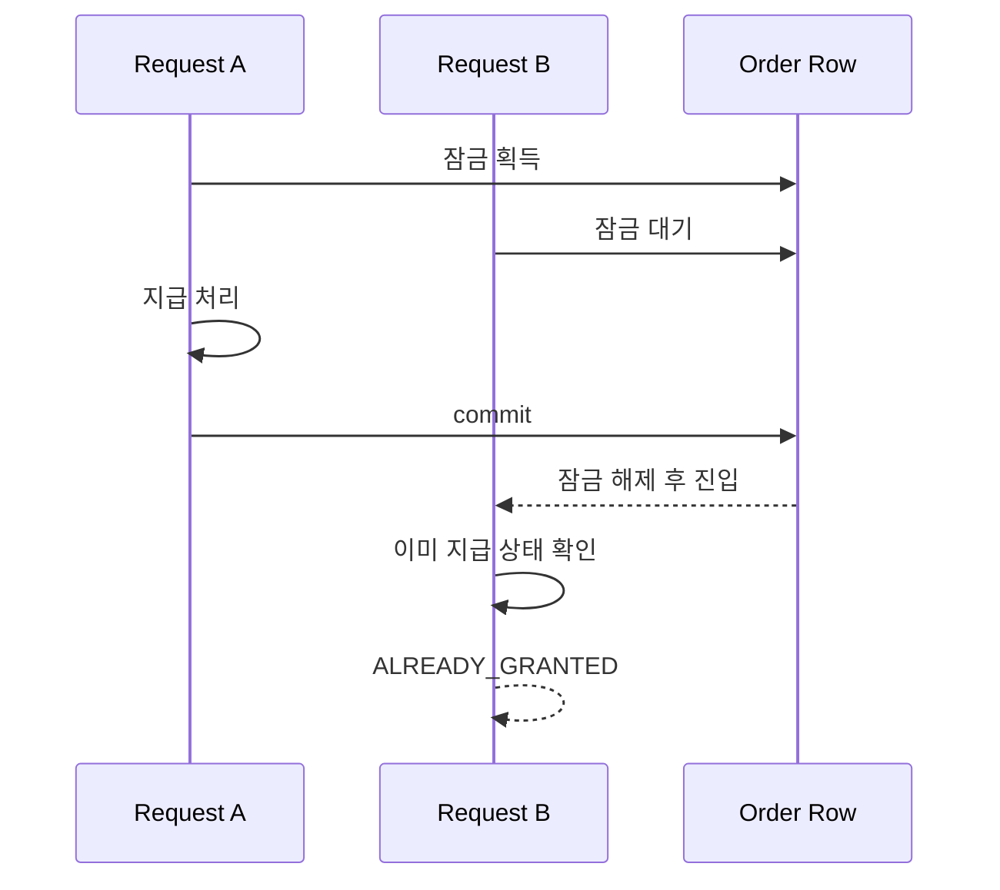
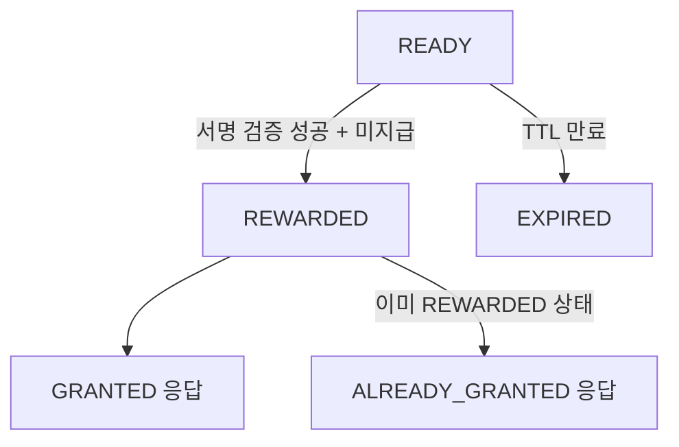
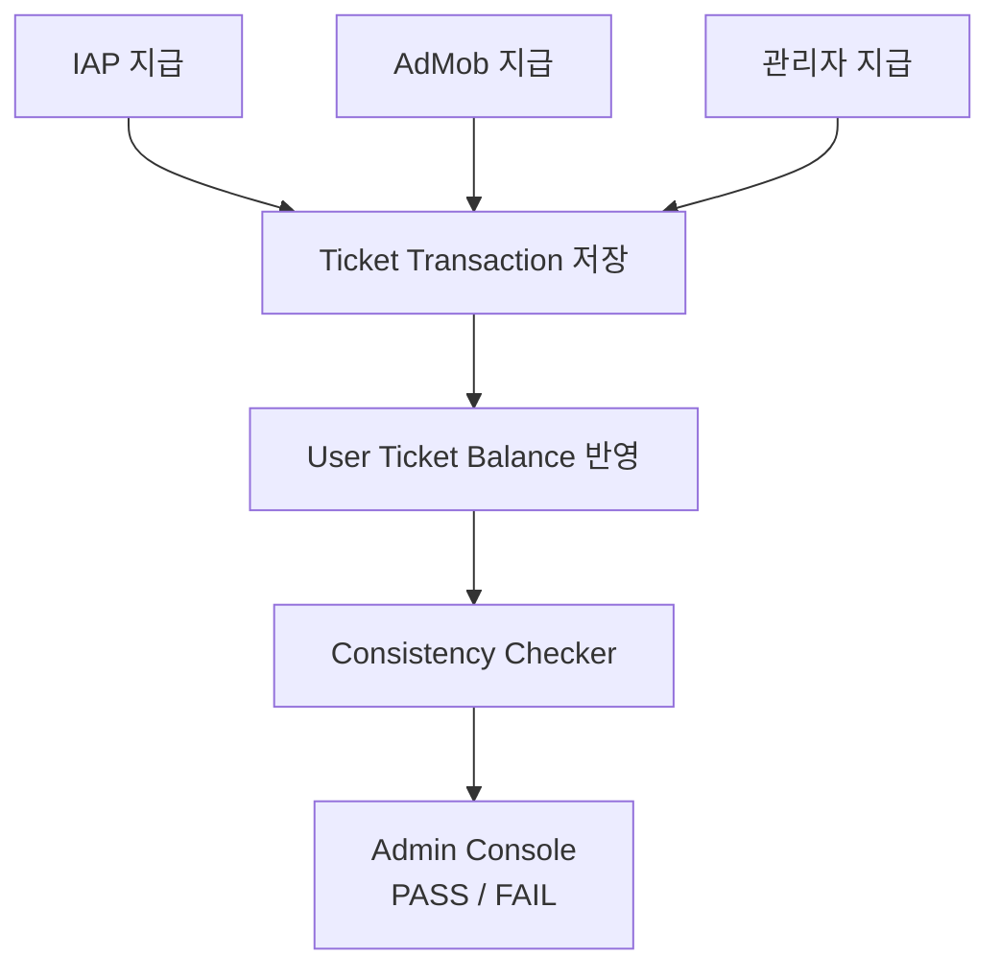

# AirConnect Portfolio Figures Editable

이 파일은 이미지가 아니라 수정 가능한 원본입니다.  
다이어그램은 `Mermaid`, 표는 `Markdown Table`로 작성했습니다.

---

## 1. AirConnect 전체 구조도

핵심 문구:

`서버 스펙보다 검증 흐름을 강조하고, 결제 / 광고 / 티켓 / 운영을 같은 상태 변경 구조 안에서 설명`

---

## 2. IAP 결제 검증 시퀀스

---

## 3. IAP 예외 케이스 테스트 표

| 테스트 케이스 | 입력 조건 | 기대 결과 | 실제 결과 |
|---|---|---|---|
| 가짜 서명 영수증 | JWS 서명 / 인증서 위조 | 거절 | 거절 |
| transactionId 불일치 | 요청값과 검증값 불일치 | 거절 | 거절 |
| 사용자 연결값 불일치 | 다른 사용자 토큰 | 거절 | 거절 |
| 환경 불일치 | Sandbox / Production 불일치 | 거절 | 거절 |
| 환불 / 취소 거래 | revocation 정보 포함 | 거절 | 거절 |
| 중복 영수증 | 이미 처리된 거래 | 이미 처리됨 | 이미 처리됨 |

주석:

`만료 거래`는 현재 코드에서 직접 확인한 테스트 근거보다, 실제 검증된 예외 항목 중심으로 정리했습니다.

---

## 4. 동시 요청 레이스 타임라인

설명 포인트:

- 왜 비관적 락을 썼는가
- 유니크 제약만으로 부족했던 이유
- 락 범위가 주문 상태 변경 구간에 걸쳐 있었다는 점
- 동시 2회 요청 테스트에서 `1건 GRANTED / 1건 ALREADY_GRANTED`로 수렴했다는 점

---

## 5. AdMob SSV 상태 전이도

중앙 문구:

`중복 요청을 막는 것이 아니라 반복 요청에도 재화 상태가 한 번만 바뀌도록 설계`

---

## 6. 티켓 원장 / 잔액 정합성 점검 흐름

### 점검 항목 표

| 점검 항목 | 정상 기준 | 오류 감지 방식 |
|---|---|---|
| 잔액과 이력 합계 일치 | balance = sum(history) | 불일치 시 FAIL |
| 지급 경로별 중복 없음 | refType + refId unique | 중복 시 FAIL |
| IAP 검증 완료 후 미지급 없음 | verified order는 지급 완료 | 미지급 시 FAIL |
| 광고 보상 세션 만료 처리 | TTL 이후 EXPIRED | 미처리 시 FAIL |
| 처리 완료 세션 중복 지급 없음 | REWARDED 1회 | 중복 시 FAIL |

---

## 7. Admin Console 정합성 점검 화면

### 예시 구조

| 점검 항목 | 정상 기준 | 결과 |
|---|---|---|
| 잔액과 이력 합계 일치 | balance = sum(history) | PASS |
| 지급 경로별 중복 이력 없음 | refType + refId unique | PASS |
| IAP 검증 완료 후 미지급 주문 없음 | verified order -> granted | PASS |
| 광고 보상 세션 만료 처리 확인 | TTL 이후 EXPIRED | PASS |
| 처리 완료 세션 중복 지급 없음 | REWARDED 1회 | PASS |
| 환불 반영 후 장부 기록 존재 | refund ledger exists | PASS |
| 운영자 수동 지급 근거 기록 | admin action logged | PASS |

하단 문구:

`불일치 강제 주입 테스트에서도 FAIL 감지가 가능한 구조로 점검 로직을 검증했습니다.`

---

## 8. Admin Console Audit Log / API 통계 화면

### 운영 지표 카드

| 항목 | 값 |
|---|---|
| 누적 Audit Log | 1,047+ |
| 최근 7일 API 호출 | 117건 |
| 고유 엔드포인트 | 24개 |
| 정합성 점검 | 7개 PASS |

### 감사 로그 예시

| 시간 | 액션 | 대상 | 결과 |
|---|---|---|---|
| 10:24 | 정합성 점검 | ticket | PASS |
| 10:27 | 신고 검토 | user 182 | DONE |
| 11:02 | 티켓 조정 | user 74 | DONE |
| 11:36 | API 통계 조회 | dashboard | OK |
| 12:14 | 공지 발송 | all users | DONE |

### API 사용량 예시

| API | 호출 수 |
|---|---:|
| GET /matches | 74 |
| GET /tickets | 58 |
| POST /iap | 46 |
| GET /admin | 39 |
| POST /ads | 31 |

